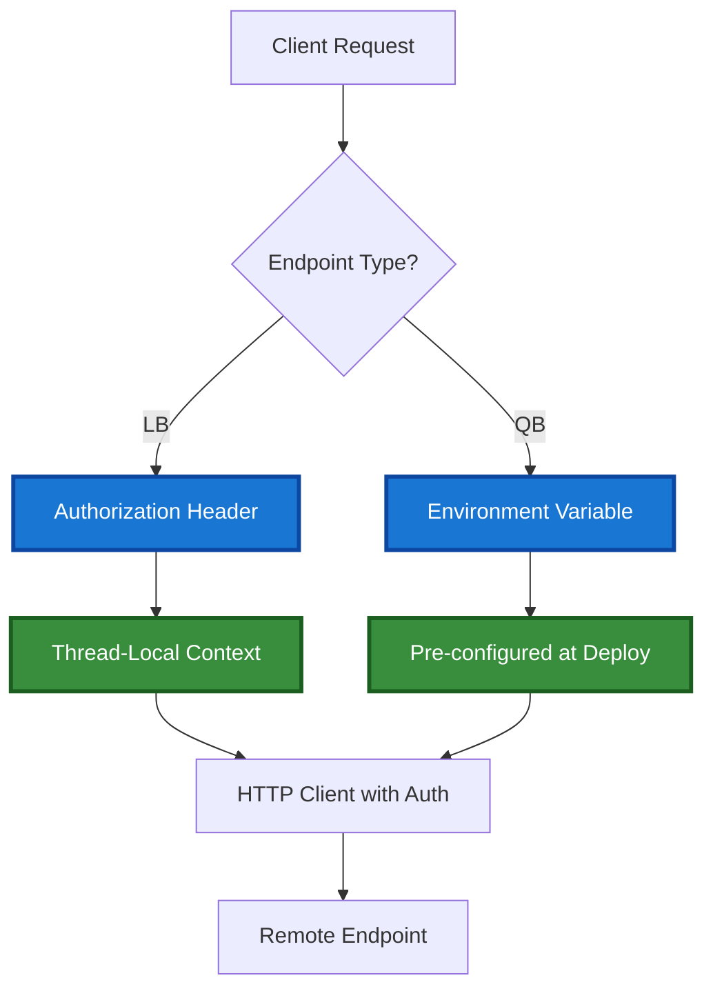

# API Key Management

This document describes how Flash handles API key propagation for cross-endpoint communication.

## Overview

Flash applications may consist of multiple endpoints (e.g., Mothership, CPU worker, GPU worker) that need to communicate with each other. API key propagation ensures that:

1. **Load-balancer endpoints** receive API keys via Authorization Bearer headers
2. **Queue-based endpoints** have API keys pre-configured in environment variables
3. **Local-only endpoints** don't waste resources querying for remote endpoint metadata

## Architecture

### Endpoint Types

Flash supports two serverless endpoint types:

- **Load-Balancer (LB)**: Direct HTTP routing with custom endpoints. Lower latency, no automatic retries.
- **Queue-Based (QB)**: Traditional queue processing with automatic retries. Higher latency, built-in error recovery.

### API Key Propagation Flow



## Implementation Details

### Load-Balancer Endpoints

**How it works:**
1. Client sends request with `Authorization: Bearer <api_key>` header
2. `lb_handler.py` middleware extracts API key from header
3. API key stored in thread-local context via `api_key_context.py`
4. Remote function calls retrieve API key from context
5. HTTP client adds Authorization header to outgoing requests

**Files involved:**
- `runtime/lb_handler.py:35-66` - Middleware extraction
- `runtime/api_key_context.py:7-43` - Thread-local storage
- `core/resources/load_balancer_sls.py:229` - Context retrieval
- `core/api/http.py:10-46` - HTTP client with auth

**Example:**
```python
# Client request
headers = {"Authorization": f"Bearer {api_key}"}
response = requests.post(endpoint_url, json=payload, headers=headers)

# Middleware extracts and stores
set_api_key(bearer_token)

# Remote call uses stored key
client = get_authenticated_httpx_client()
```

### Queue-Based Endpoints

**How it works:**
1. Build/scan determines which endpoints make remote calls
2. Manifest includes `makes_remote_calls: bool` for each resource
3. During deployment, `serverless.py` checks manifest
4. If `makes_remote_calls=True`, inject `RUNPOD_API_KEY` into env vars
5. Endpoint uses env var for all outgoing remote calls

**Files involved:**
- `build/scanner.py:32-37` - Dependency analysis
- `build/manifest.py:373` - Manifest generation
- `core/resources/serverless.py:530-565` - API key injection

**Example:**
```python
# Deploy time (serverless.py)
if self.type == ServerlessType.QB:
    makes_remote_calls = self._check_makes_remote_calls()
    if makes_remote_calls and "RUNPOD_API_KEY" not in env_dict:
        env_dict["RUNPOD_API_KEY"] = os.getenv("RUNPOD_API_KEY")

# Runtime (worker uses env var)
api_key = os.getenv("RUNPOD_API_KEY")
```

### Conditional Manifest Synchronization

**Optimization:** Endpoints that only execute local functions don't need to query State Manager for remote endpoint URLs.

**How it works:**
1. Local manifest includes `makes_remote_calls` field for each resource
2. `ServiceRegistry.__init__()` checks if current endpoint makes remote calls
3. If `makes_remote_calls=False`, skip State Manager queries
4. Saves API calls and reduces latency for local-only endpoints

**Files involved:**
- `runtime/service_registry.py:81-97` - Check local manifest
- `runtime/service_registry.py:169-178` - Skip State Manager query

**Example:**
```python
# ServiceRegistry checks manifest
self._makes_remote_calls = self._check_makes_remote_calls(resource_name)

# Skip State Manager if local-only
async def _ensure_manifest_loaded(self) -> None:
    if not self._makes_remote_calls:
        logger.debug("Endpoint is local-only, skipping State Manager query")
        return
```

## Security Considerations

### Current Implementation

**API Key Storage:**
- Stored as plain text environment variable: `RUNPOD_API_KEY`
- Injected during deployment (not per-request)
- Visible in endpoint environment configuration

**Risks:**
- API keys visible to anyone with access to endpoint settings
- No automatic rotation mechanism
- Requires redeployment for key updates

### Best Practices

1. **Least Privilege**: Only inject API keys for endpoints that need them
2. **Monitoring**: Log API key injection events (without exposing the key)
3. **Rotation**: Plan for periodic key rotation with coordinated redeployment
4. **Access Control**: Restrict access to endpoint configuration UI

### Future Migration: RunPod Secrets Service

RunPod plans to offer a secrets service for secure credential management. Flash will migrate to this pattern:

```python
# Future: Use RunPod secrets service instead of bare string
env_dict["RUNPOD_API_KEY"] = {"__secret__": "FLASH_APP_API_KEY"}
```

**Benefits:**
- Encrypted at rest and in transit
- Centralized secret rotation
- Audit logging for secret access
- Reduced attack surface

## Troubleshooting

### Issue: Remote calls fail with authentication error

**Symptom:**
```
401 Unauthorized: Invalid API key
```

**Diagnosis:**
1. Check if `RUNPOD_API_KEY` is set in your environment:
   ```bash
   echo $RUNPOD_API_KEY
   ```

2. For QB endpoints, verify API key was injected during deployment:
   ```bash
   # Check deployment logs for:
   # "Injected RUNPOD_API_KEY for remote calls"
   ```

3. For LB endpoints, verify client sends Authorization header:
   ```python
   headers = {"Authorization": f"Bearer {api_key}"}
   ```

**Resolution:**
- Set `RUNPOD_API_KEY` environment variable before deployment
- For LB: Ensure client includes Authorization header
- For QB: Redeploy endpoint to inject API key

### Issue: Manifest sync errors

**Symptom:**
```
Failed to load manifest from State Manager
```

**Diagnosis:**
1. Check if endpoint needs remote calls:
   ```bash
   # Check flash_manifest.json
   cat flash_manifest.json | jq '.resources.<endpoint-name>.makes_remote_calls'
   ```

2. If `false`, this is expected (optimization working correctly)
3. If `true`, verify State Manager connectivity

**Resolution:**
- For local-only endpoints: No action needed (optimization working)
- For remote-calling endpoints: Check network connectivity and API key

### Issue: API key rotation

**Current limitation:** API key rotation requires redeployment of all endpoints that use the key.

**Workaround:**
1. Set new `RUNPOD_API_KEY` environment variable
2. Redeploy all endpoints:
   ```bash
   flash deploy
   ```
3. Verify new key is injected in deployment logs

**Future:** RunPod secrets service will enable rotation without redeployment.

## Testing

### Manual Testing with Local Docker

```bash
# Deploy to local Docker
cd flash-examples/<example-app>
flash deploy --preview --use-local-flash

# Test scenarios:
# 1. Mothership + GPU worker (LB): Verify API key in Authorization header
# 2. Mothership + CPU worker + GPU worker (QB): Verify API key in CPU worker env
# 3. Mothership only: Verify no API key needed
```

### Automated Tests

**Unit tests:**
- `tests/unit/runtime/test_service_registry.py` - Conditional manifest sync
- `tests/unit/resources/test_serverless.py` - API key injection logic

**Integration tests:**
- `tests/integration/test_api_key_propagation.py` - Full chain testing
- `tests/integration/test_local_only_endpoint.py` - Verify optimization

## Summary

Flash implements API key propagation tailored to each endpoint type:

- **LB endpoints**: Per-request via Authorization header
- **QB endpoints**: Pre-configured via environment variable
- **Local-only endpoints**: Skip manifest sync optimization

This design balances security, performance, and operational simplicity while maintaining a clear migration path to RunPod's future secrets service.
