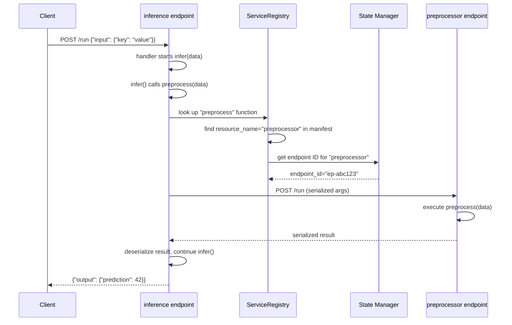

# Cross-Endpoint Routing

## Overview

Flash enables functions on different endpoints to call each other at runtime. When you deploy multiple endpoints with `flash deploy`, the runtime automatically discovers sibling endpoints using the manifest and routes calls between them.

## How It Works

### The Problem

Each `@Endpoint(...)` function deploys as its own serverless endpoint with dedicated workers. When function A needs to call function B, it must:

1. Know where function B is deployed (which endpoint ID)
2. Authenticate with the Runpod API
3. Serialize arguments and deserialize results
4. Handle the network round-trip

### The Solution

Flash handles all of this automatically:

1. **Build time**: `flash build` creates a `flash_manifest.json` mapping function names to endpoint names
2. **Deploy time**: `flash deploy` provisions endpoints and registers their IDs with the State Manager
3. **Runtime**: When function A calls function B, Flash's runtime wrapper:
   - Looks up function B's endpoint in the manifest
   - Queries the State Manager for the endpoint ID
   - Serializes arguments via cloudpickle
   - Calls the endpoint via Runpod's API
   - Deserializes and returns the result

## Example

### User Code

```python
# preprocess.py
from runpod_flash import Endpoint

@Endpoint(name="preprocessor", cpu="cpu3c-4-8")
def preprocess(raw_data: dict) -> dict:
    """clean and normalize data on CPU."""
    cleaned = {k: v.strip() if isinstance(v, str) else v for k, v in raw_data.items()}
    return {"cleaned": cleaned}


# inference.py
from runpod_flash import Endpoint, GpuGroup

@Endpoint(
    name="inference",
    gpu=GpuGroup.AMPERE_80,
    dependencies=["torch"],
)
async def infer(data: dict) -> dict:
    """run inference on GPU, calling preprocessor first."""
    # this call routes to the preprocessor endpoint at runtime
    clean = preprocess(data)
    import torch
    tensor = torch.tensor(list(clean["cleaned"].values()))
    return {"prediction": tensor.sum().item()}
```

### Build and Deploy

```bash
flash build
flash deploy --env production
```

### What Happens at Build Time

`flash build` scans for `Endpoint` definitions and produces a manifest:

```json
{
    "functions": [
        {
            "name": "preprocess",
            "module_path": "preprocess",
            "resource_name": "preprocessor",
            "is_load_balanced": false,
            "is_class": false,
            "dependencies": []
        },
        {
            "name": "infer",
            "module_path": "inference",
            "resource_name": "inference",
            "is_load_balanced": false,
            "is_class": false,
            "dependencies": ["torch"],
            "makes_remote_calls": true
        }
    ],
    "resources": [
        {
            "name": "preprocessor",
            "is_load_balanced": false
        },
        {
            "name": "inference",
            "is_load_balanced": false
        }
    ]
}
```

The `makes_remote_calls` flag tells Flash that the `infer` function calls other endpoint functions, so the runtime wrapper needs to inject API key context and service discovery.

### What Happens at Runtime

When `infer` is deployed and a request arrives:



## Runtime Components

### ServiceRegistry

The `ServiceRegistry` loads `flash_manifest.json` at startup and provides function-to-endpoint mapping:

```python
# runtime usage (inside deployed workers)
registry = ServiceRegistry()
endpoint_name = registry.get_endpoint_for_function("preprocess")
# returns "preprocessor"
```

### State Manager

The State Manager is a Runpod GraphQL service that stores endpoint IDs for each environment. During deployment, Flash registers:

```
environment_id + resource_name -> endpoint_id
```

At runtime, the registry queries:

```
"preprocessor" -> "ep-abc123"
```

### Runtime Wrapper

Each deployed function is wrapped with a production wrapper that:

1. Loads the manifest on cold start
2. Injects `RUNPOD_API_KEY` into the execution context
3. Intercepts calls to other endpoint functions
4. Routes those calls through the Runpod API
5. Handles serialization/deserialization transparently

## API Key Injection

Cross-endpoint calls require authentication. Flash handles this automatically:

1. The deploying environment sets `RUNPOD_API_KEY` as an env var on each endpoint
2. At runtime, the wrapper reads `RUNPOD_API_KEY` from the environment
3. All outbound calls to sibling endpoints include the API key

This means your function code never needs to handle API keys directly.

## Load-Balanced Cross-Endpoint Calls

LB endpoints can also participate in cross-endpoint routing:

```python
# api.py
from runpod_flash import Endpoint, GpuGroup

api = Endpoint(name="api-gateway", cpu="cpu3c-2-4", workers=(1, 3))

@api.post("/predict")
async def predict(data: dict):
    # calls a QB endpoint
    result = await infer(data)
    return {"prediction": result}


# inference.py
from runpod_flash import Endpoint, GpuGroup

@Endpoint(name="inference", gpu=GpuGroup.AMPERE_80)
async def infer(data: dict) -> dict:
    import torch
    return {"result": 42}
```

The LB endpoint's handler code references `infer()` by name. At runtime, the wrapper intercepts the call and routes it to the QB endpoint.

## Limitations

- **Latency**: Cross-endpoint calls add network round-trip time (typically 50-200ms per hop)
- **Serialization**: Arguments and results must be serializable via cloudpickle
- **Cold starts**: If the target endpoint has scaled to zero, the first cross-endpoint call triggers a cold start
- **No circular calls**: Function A calling B calling A will deadlock or timeout
- **QB only as targets**: Cross-endpoint calls target QB endpoints. LB endpoints can be callers but not targets of function-level routing (use HTTP client calls for LB-to-LB)

## Debugging Cross-Endpoint Calls

### Common Issues

**"Function not found in manifest"**
- Ensure both functions are in files scanned by `flash build`
- Check that the calling function's file is not in `.flashignore`
- Verify the manifest with `cat .flash/flash_manifest.json`

**"Endpoint not found in State Manager"**
- Ensure both endpoints are deployed in the same environment
- Check `flash env get <env>` to see registered endpoints

**"Timeout waiting for response"**
- The target endpoint may be cold-starting. Increase idle_timeout or set workers=(1, N)
- Check target endpoint logs in the Runpod console

**"Serialization error"**
- Ensure function arguments are picklable
- Avoid passing file handles, database connections, or other non-serializable objects

### Inspecting the Manifest

```bash
# after flash build
cat .flash/flash_manifest.json | python -m json.tool

# check which functions make remote calls
cat .flash/flash_manifest.json | python -c "
import json, sys
m = json.load(sys.stdin)
for f in m.get('functions', []):
    if f.get('makes_remote_calls'):
        print(f'{f[\"name\"]} -> calls other endpoints')
"
```

## Related Documentation

- [Deployment Architecture](Deployment_Architecture.md) -- build and deploy flow
- [Flash Deploy Guide](Flash_Deploy_Guide.md) -- deployment walkthrough
- [LoadBalancer Runtime Architecture](LoadBalancer_Runtime_Architecture.md) -- LB-specific runtime details
