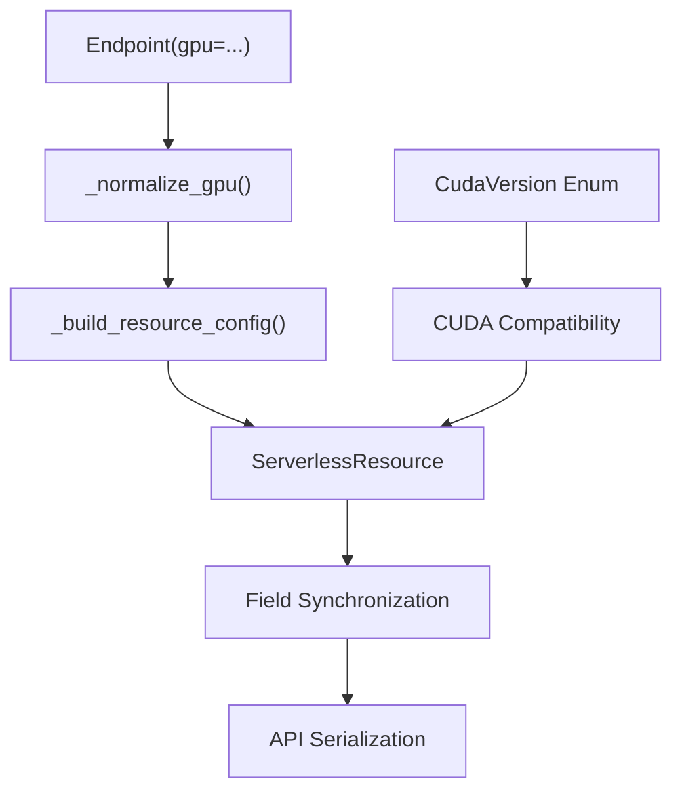

# GPU Provisioning Architecture

## Overview

This document describes the architectural design and implementation of GPU provisioning for serverless endpoints. The system manages GPU resource allocation, CUDA version compatibility, and GPU group selection through a flexible and extensible design.

## Problem Statement

GPU provisioning requires sophisticated resource management:

- Multiple GPU types with different capabilities and memory configurations
- CUDA version compatibility across different GPU architectures
- Dynamic GPU group selection and availability
- Integration with cloud provider GPU inventory
- Pricing optimization and resource allocation

## User-Facing API

All GPU provisioning is configured through the `Endpoint` class:

```python
from runpod_flash import Endpoint, GpuGroup, GpuType

# architecture-level GPU selection (GpuGroup)
@Endpoint(name="inference", gpu=GpuGroup.AMPERE_80, workers=(0, 5))
async def infer(data: dict) -> dict:
    return {"result": data}

# specific GPU model (GpuType)
@Endpoint(name="rtx-worker", gpu=GpuType.NVIDIA_GEFORCE_RTX_4090)
async def render(data: dict) -> dict:
    return {"result": data}

# multiple GPU groups for fallback
@Endpoint(name="flexible", gpu=[GpuGroup.AMPERE_80, GpuGroup.ADA_80_PRO])
async def flexible(data: dict) -> dict:
    return {"result": data}

# multi-GPU per worker
@Endpoint(name="large-model", gpu=GpuGroup.HOPPER_141, gpu_count=2)
async def large_model(data: dict) -> dict:
    return {"result": data}
```

When no `gpu=` or `cpu=` is specified, `Endpoint` defaults to `GpuGroup.ANY`.

## Internal Architecture

### Core Components



### How Endpoint Maps to Resource Classes

When `Endpoint._build_resource_config()` runs, the GPU configuration is passed to the appropriate internal resource class:

| Endpoint Config                    | Internal Class       | Notes                             |
| ---------------------------------- | -------------------- | --------------------------------- |
| `gpu=GpuGroup.ADA_24` (QB)         | `LiveServerless`     | Locked image, full code execution |
| `gpu=GpuGroup.ADA_24` (LB)         | `LiveLoadBalancer`   | Locked image, HTTP routes         |
| `image="...", gpu=GpuGroup.ADA_24` | `ServerlessEndpoint` | Custom image, raw JSON only       |
| `cpu="cpu3c-1-2"`                  | `CpuLiveServerless`  | CPU endpoint, no GPU              |

The GPU normalization pipeline (`_normalize_gpu()`) handles:

- Single `GpuGroup` -> `[GpuGroup]`
- Single `GpuType` -> `[GpuType]`
- Mixed lists of `GpuGroup`/`GpuType` -> flattened list
- `None` -> `None` (resolved later based on cpu= presence)

### Worker-Based GPU Scaling

GPU provisioning is managed through a worker scaling model:

```python
# each worker gets the configured GPU(s)
@Endpoint(
    name="ml-server",
    gpu=GpuGroup.AMPERE_80,
    workers=(1, 10),          # 1-10 workers, each with 1x A100
    gpu_count=1,              # GPUs per worker (default 1)
    scaler_value=4,           # scale up when queue delay > 4s
)
async def serve(data: dict) -> dict:
    return {"result": data}
```

#### Scaling Strategies

| Scaler Type     | Description                                     | Scaling Trigger                         |
| --------------- | ----------------------------------------------- | --------------------------------------- |
| `QUEUE_DELAY`   | Scale based on request queue delay (QB default) | `scaler_value` seconds of queue time    |
| `REQUEST_COUNT` | Scale based on request volume (LB default)      | `scaler_value` requests per time window |

The scaler type is auto-selected based on usage pattern. QB endpoints default to `QUEUE_DELAY`, LB endpoints default to `REQUEST_COUNT`. Override with `scaler_type=`:

```python
from runpod_flash import Endpoint, GpuGroup, ServerlessScalerType

@Endpoint(
    name="custom-scaling",
    gpu=GpuGroup.ANY,
    scaler_type=ServerlessScalerType.QUEUE_DELAY,
    scaler_value=2,
)
async def worker(data: dict) -> dict:
    return {"result": data}
```

## GPU Group Classification

GPU groups are organized by architecture, memory, and performance tier:

| Group        | Architecture | Memory | Examples  | Use Cases                       |
| ------------ | ------------ | ------ | --------- | ------------------------------- |
| `ADA_24`     | Ada Lovelace | 24GB   | RTX 4090  | ML inference, gaming            |
| `ADA_32_PRO` | Ada Lovelace | 32GB   | RTX 5090  | Professional graphics, training |
| `ADA_48_PRO` | Ada Lovelace | 48GB   | L40, L40S | AI training, rendering          |
| `ADA_80_PRO` | Ada Lovelace | 80GB   | H100 PCIe | Large model training            |
| `AMPERE_16`  | Ampere       | 16GB   | RTX A4000 | Development, small models       |
| `AMPERE_24`  | Ampere       | 24GB   | RTX 3090  | Research, mid-size training     |
| `AMPERE_48`  | Ampere       | 48GB   | A40       | Professional ML workloads       |
| `AMPERE_80`  | Ampere       | 80GB   | A100      | Large-scale training            |
| `HOPPER_141` | Hopper       | 141GB  | H200      | Cutting-edge AI research        |

`GpuGroup.ANY` expands to all available GPU groups at validation time, maximizing job placement opportunities.

## CUDA Version Management

CUDA compatibility is managed through the `CudaVersion` enum:

```python
class CudaVersion(Enum):
    V11_8 = "11.8"
    V12_0 = "12.0"
    V12_1 = "12.1"
    V12_2 = "12.2"
    V12_3 = "12.3"
    V12_4 = "12.4"
    V12_5 = "12.5"
    V12_6 = "12.6"
    V12_7 = "12.7"
    V12_8 = "12.8"
```

### CUDA Compatibility Matrix

| GPU Architecture | Supported CUDA Versions | Recommended |
| ---------------- | ----------------------- | ----------- |
| Ampere           | 11.8+                   | 12.0+       |
| Ada Lovelace     | 11.8+                   | 12.1+       |
| Hopper           | 12.0+                   | 12.4+       |

## Field Synchronization System

Internally, the `ServerlessResource` base class maintains dual fields for developer experience and API compatibility:

| Developer Field                         | API Field                  | Purpose             |
| --------------------------------------- | -------------------------- | ------------------- | ----------------------------------------------------------- |
| `gpus: List[GpuGroup]`                  | `gpuIds: str`              | GPU group selection |
| `cudaVersions: List[CudaVersion]`       | `allowedCudaVersions: str` | CUDA compatibility  |
| `min_cuda_version: str` (on `Endpoint`) | `minCudaVersion: str       | CudaVersion`        | Minimum CUDA version for host selection (default: `"12.8"`) |

The `_sync_input_fields_gpu()` method synchronizes between these formats. When a user sets `gpu=GpuGroup.AMPERE_80` on `Endpoint`, the value flows through:

1. `_normalize_gpu()` converts to `[GpuGroup.AMPERE_80]`
2. `_build_resource_config()` passes to `ServerlessResource(gpus=[GpuGroup.AMPERE_80])`
3. `_sync_input_fields_gpu()` converts to `gpuIds="AMPERE_80"` for the API

## GPU Metadata System

The system supports querying GPU metadata for pricing and availability:

```python
class GpuType(BaseModel):
    id: str                 # unique GPU identifier
    displayName: str        # human-readable name
    memoryInGb: int         # GPU memory capacity

class GpuTypeDetail(GpuType):
    communityCloud: Optional[bool]
    communityPrice: Optional[float]
    cudaCores: Optional[int]
    manufacturer: Optional[str]
    maxGpuCount: Optional[int]
    secureCloud: Optional[bool]
    securePrice: Optional[float]
```

## Usage Examples

### Basic GPU Endpoint

```python
from runpod_flash import Endpoint, GpuGroup

@Endpoint(name="gpu-inference", gpu=GpuGroup.AMPERE_24, workers=(0, 5))
async def inference(data: dict) -> dict:
    return {"result": data}
```

### High-Throughput Configuration

```python
from runpod_flash import Endpoint, GpuGroup, ServerlessScalerType

@Endpoint(
    name="high-throughput",
    gpu=GpuGroup.ANY,
    workers=(3, 20),
    scaler_type=ServerlessScalerType.REQUEST_COUNT,
    scaler_value=50,
)
async def high_throughput(data: dict) -> dict:
    return {"result": data}
```

### High-Memory Workloads

```python
from runpod_flash import Endpoint, GpuGroup

@Endpoint(
    name="large-model",
    gpu=[GpuGroup.AMPERE_80, GpuGroup.HOPPER_141],
    workers=(0, 3),
)
async def large_model_inference(data: dict) -> dict:
    return {"result": data}
```

### GPU Selection Strategy

When choosing GPUs, consider:

1. **Memory requirements**: Match GPU memory to model size
2. **Architecture compatibility**: Consider CUDA version requirements
3. **Cost optimization**: Balance performance vs. pricing
4. **Availability**: Use multiple GPU options for better scheduling

```python
# memory-optimized selection based on model size
def select_gpu_for_model(model_gb: float) -> list:
    if model_gb <= 16:
        return [GpuGroup.AMPERE_24, GpuGroup.ADA_24]
    elif model_gb <= 48:
        return [GpuGroup.AMPERE_48, GpuGroup.ADA_48_PRO]
    else:
        return [GpuGroup.AMPERE_80, GpuGroup.ADA_80_PRO, GpuGroup.HOPPER_141]
```

## Design Decisions

### Enum-Based GPU Groups

GPU groups use enums for type safety, IDE autocompletion, clear documentation, and easy extension for new GPU types.

### "ANY" GPU Expansion

`GpuGroup.ANY` expands to all available GPU groups at validation time. This maximizes job placement opportunities and simplifies the common use case of "any available GPU".

### Locked Images for Live Endpoints

`Endpoint` in decorator mode (without `image=`) uses a fixed, optimized Docker image. This ensures compatibility with Flash's remote code execution runtime, prevents configuration errors, and provides a consistent execution environment. Use `image=` when you need a custom Docker image.

## Related Documentation

- [Flash SDK Reference](Flash_SDK_Reference.md) -- complete Endpoint API reference
- [CPU Container Disk Sizing](CPU_Container_Disk_Sizing.md) -- CPU-specific disk defaults
- [Resource Config Drift Detection](Resource_Config_Drift_Detection.md) -- how GPU changes trigger drift
