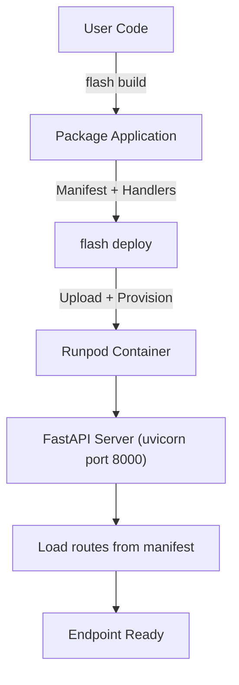
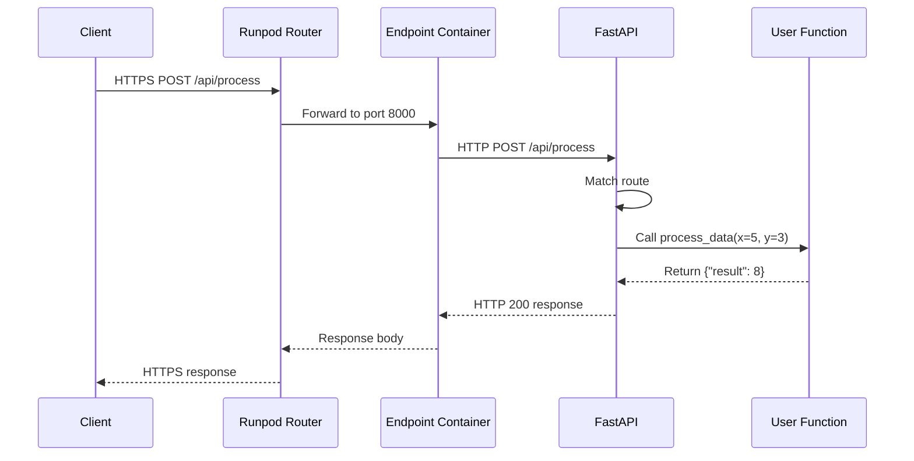

# Load-Balanced Endpoint Runtime Architecture

## Overview

This document explains what happens after a load-balanced endpoint is deployed on Runpod and is actively running. It covers container startup, request flows, execution patterns, and the security model.

## Deployment Architecture

### Container Image and Startup

When you deploy a load-balanced `Endpoint` with `flash build` and `flash deploy`:



**Container setup:**
- Base image: `runpod/worker-flash-lb:latest` (GPU) or `runpod/worker-flash-lb-cpu:latest` (CPU)
- Contains FastAPI, uvicorn, and Flash runtime dependencies
- Entrypoint: Loads manifest and starts FastAPI server on port 8000
- Runpod exposes this via HTTPS endpoint URL
- Health check: Runpod polls `/ping` every 30 seconds
- Environment: `RUNPOD_API_KEY` injected when `makes_remote_calls=True`, plus any explicit `env={}` vars

### What Gets Deployed

The runtime loads your application from the manifest and registers routes:

```python
# user code
from runpod_flash import Endpoint

api = Endpoint(name="my-api", cpu="cpu3c-4-8", workers=(1, 5))

@api.post("/api/process")
async def process_data(x: int, y: int):
    return {"result": x + y}
```

At runtime, Flash's LB handler discovers this route from the manifest and registers it with FastAPI. The resulting server handles:
- `POST /api/process` -> calls `process_data(x, y)`
- `GET /ping` -> health check (built-in)

## Request Flow

### Direct HTTP Requests

When a client makes an HTTP request to a deployed LB endpoint:



**Example:**

```python
# user code
api = Endpoint(name="my-api", cpu="cpu3c-4-8", workers=(1, 5))

@api.post("/api/process")
async def process_data(x: int, y: int):
    return {"result": x + y}

# client request
# POST https://{endpoint-id}.api.runpod.ai/api/process
# Content-Type: application/json
# {"x": 5, "y": 3}
#
# response: {"result": 8}
```

### URL Format

LB endpoints use subdomain-based URLs:

```
https://{endpoint-id}.api.runpod.ai/{path}
```

This differs from QB endpoints which use path-based URLs:

```
https://api.runpod.ai/v2/{endpoint-id}/runsync
```

## Security Model

### /execute Endpoint

The `/execute` endpoint accepts and runs arbitrary Python code. It exists **only during local development** (`flash run`).

**In local development (`flash run`):**
- `/execute` is available for Flash's remote code execution protocol
- Code originates from your own `Endpoint`-decorated functions
- Safe because only you can run code locally

**In deployed endpoints (`flash deploy`):**
- `/execute` is **not exposed**
- Only user-defined routes and `/ping` are available
- No arbitrary code execution possible

**Why this matters:** An exposed `/execute` endpoint would allow anyone with network access to execute arbitrary Python code on your infrastructure, including system commands and credential theft.

## Concurrency and Scaling

### How Runpod Handles Concurrent Requests

```
Request 1 (POST /api/process) -> Worker 1
Request 2 (POST /api/users)   -> Worker 1 (concurrent, async)
Request 3 (POST /api/health)  -> Worker 2 (new worker)
```

Runpod scales workers based on the `REQUEST_COUNT` scaler:
- When active requests exceed `scaler_value`, new workers spin up
- When requests drop, workers scale down after `idle_timeout`
- Async functions can handle multiple requests concurrently within a single worker

**Async concurrency example:**

```python
@api.post("/api/process")
async def process_data(x: int):
    import asyncio
    await asyncio.sleep(10)  # simulate work
    return {"result": x}

# 5 concurrent requests:
# requests 1-3: concurrent on worker 1 (async)
# requests 4-5: concurrent on worker 2 (new worker)
# all 5 complete in ~10s
```

Synchronous functions block the worker thread and are processed one at a time per worker.

## Error Handling

### Client Errors

```
POST https://endpoint.runpod.ai/api/users
{"invalid json

# Response: 422 Unprocessable Entity
```

### Function Errors

```python
@api.post("/api/users")
async def create_user(name: str):
    if not name:
        raise ValueError("Name required")
    return {"id": 1, "name": name}

# POST with {"name": ""}
# Response: 500 Internal Server Error
```

### Health Check Responses

```
GET https://{endpoint-id}.api.runpod.ai/ping
# 200 OK: {"status": "healthy"}

# Runpod polls /ping every 30 seconds
# 200 OK -> worker healthy
# non-200 -> worker unhealthy, may be replaced
# no response -> worker down, replaced
```

## Performance Characteristics

### Request Latency (approximate)

```
direct HTTP request (no-op function):
  client -> Runpod router: 10-50ms
  FastAPI routing: 1-5ms
  function execution: variable
  response: 10-50ms
  total: ~30-110ms
```

### Memory Usage

- FastAPI app baseline: ~50-100MB
- Per function in namespace: ~0.5-5MB
- Runpod allocates based on pod type

### Request Size Limits

- Runpod has limits on request body size
- Consider streaming for large payloads

## Monitoring and Debugging

### Logs

Container logs include:
- Request arrival and route matching
- Function execution and errors
- Response generation

View logs in the Runpod console or via `runpod-cli logs <endpoint-id>`.

### Common Issues

**"Connection refused"**
- Container not running or uvicorn failed to start
- Check container logs

**"Timeout"**
- Function took too long
- Increase `execution_timeout_ms` on the endpoint

**"500 Internal Server Error"**
- Function raised an exception
- Check container logs for the traceback

**"404 Not Found"**
- Route not registered in manifest
- Verify route paths in your code

## Related Documentation

- [Load-Balanced Endpoints](Using_Remote_With_LoadBalancer.md) -- user guide for LB endpoints
- [Load Balancer Endpoints (Internal)](Load_Balancer_Endpoints.md) -- provisioning architecture
- [Flash SDK Reference](Flash_SDK_Reference.md) -- complete API reference
