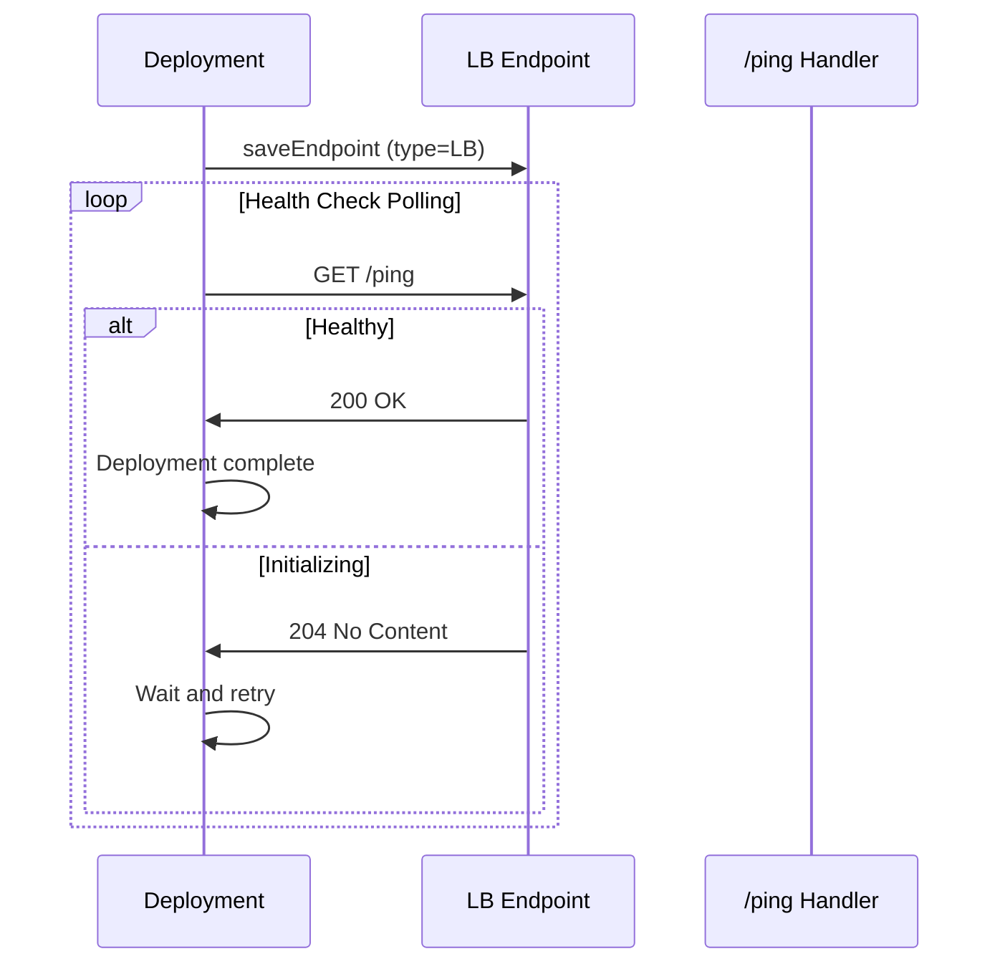

# Load-Balanced Serverless Endpoints

## Overview

Load-balanced (LB) serverless endpoints expose HTTP servers directly to clients, enabling REST APIs, webhooks, and real-time communication patterns. Requests are routed directly to available workers instead of being queued.

**User-facing API:** Use `Endpoint` with the LB pattern (`ep = Endpoint(...)` + `@ep.post("/path")`). See [Flash SDK Reference](Flash_SDK_Reference.md).

**Internal implementation:** The `LoadBalancerSlsResource` class handles provisioning. `Endpoint` creates these internally based on usage pattern.

## Design Context

### QB vs LB

| Feature | Queue-Based (QB) | Load-Balanced (LB) |
|---------|------------------|-------------------|
| Request model | Sequential queue | Direct HTTP routing |
| Retries | Automatic | Manual (client) |
| Latency | Higher (queuing) | Lower (direct) |
| Custom endpoints | Limited | Full HTTP support |
| Health checks | Runpod SDK | `/ping` endpoint |
| Use cases | Batch processing | APIs, webhooks, real-time |
| Default scaler | `QUEUE_DELAY` | `REQUEST_COUNT` |

### When to Use LB

Use LB endpoints when you need:
- Custom HTTP routes (GET, POST, PUT, DELETE, PATCH)
- Low-latency direct request handling
- Multiple routes sharing the same workers
- REST API semantics

## Creating LB Endpoints

```python
from runpod_flash import Endpoint, GpuGroup

# GPU load-balanced endpoint
api = Endpoint(name="inference-api", gpu=GpuGroup.ADA_24, workers=(1, 5))

@api.post("/predict")
async def predict(data: dict) -> dict:
    import torch
    return {"prediction": data}

@api.get("/health")
async def health():
    return {"status": "ok"}


# CPU load-balanced endpoint
data_api = Endpoint(name="data-api", cpu="cpu3c-4-8", workers=(1, 3))

@data_api.post("/process")
async def process(data: dict) -> dict:
    return {"echo": data}

@data_api.get("/health")
async def data_health():
    return {"status": "healthy"}
```

## Internal Architecture

### How Endpoint Maps to LoadBalancerSlsResource

When `Endpoint._build_resource_config()` detects registered routes, it creates a `LoadBalancerSlsResource` (GPU) or `CpuLoadBalancerSlsResource` (CPU):

```
Endpoint(name="api", gpu=GpuGroup.ADA_24, workers=(1, 5))
    │
    ├── @ep.post("/predict") registered
    ├── @ep.get("/health") registered
    │
    └── _build_resource_config() detects routes
        └── Creates LoadBalancerSlsResource(
                name="api",
                type=LB,
                scalerType=REQUEST_COUNT,
                gpus=[GpuGroup.ADA_24],
                workersMin=1,
                workersMax=5,
            )
```

### LoadBalancerSlsResource Internals

`LoadBalancerSlsResource` extends `ServerlessResource` with LB-specific behavior:

- **Type enforcement**: Always deploys as `ServerlessType.LB`
- **Scaler validation**: Requires `REQUEST_COUNT` scaler (not `QUEUE_DELAY`)
- **Health checks**: Polls `/ping` endpoint to verify worker availability
- **Post-deployment verification**: Waits for endpoint readiness before returning

### Health Check Mechanism

LB endpoints require a `/ping` endpoint (automatically provided by the Flash runtime):

- **200 OK**: Worker is healthy and ready
- **204 No Content**: Worker is initializing
- **Other status**: Worker is unhealthy



### Configuration Hierarchy

```
ServerlessResource (base)
├── type: QB (default)
├── scalerType: QUEUE_DELAY (default)
└── Standard provisioning

LoadBalancerSlsResource (LB subclass)
├── type: LB (always, enforced)
├── scalerType: REQUEST_COUNT (required)
├── Health check polling via /ping
└── Post-deployment readiness verification
```

## Deployment Timeline

| Phase | Duration | Notes |
|-------|----------|-------|
| API call | < 1s | Runpod endpoint creation |
| Worker initialization | 30-60s | Container pull + startup |
| Health check pass | 10-30s | /ping returns 200 |
| Total | ~1-2min | Until first request served |

## Reserved Paths

The following paths are used by the framework and cannot be used for user routes:

- `/ping` -- health check endpoint
- `/execute` -- internal framework endpoint (local dev only)

## Troubleshooting

### Endpoint Not Ready After Deployment

- Workers take 30-60s to cold start
- Verify the image runs correctly
- Check endpoint logs in Runpod console

### Configuration Validation Error

If you get `"LoadBalancerSlsResource requires REQUEST_COUNT scaler"`, you may have explicitly set `scaler_type=ServerlessScalerType.QUEUE_DELAY` on an LB endpoint. Remove the `scaler_type` parameter or set it to `REQUEST_COUNT`.

When using `Endpoint`, the scaler type is auto-selected based on usage pattern, so this error should not occur.

## Related Documentation

- [Load-Balanced Endpoints User Guide](Using_Remote_With_LoadBalancer.md) -- creating and testing LB endpoints
- [LoadBalancer Runtime Architecture](LoadBalancer_Runtime_Architecture.md) -- runtime execution details
- [Flash SDK Reference](Flash_SDK_Reference.md) -- complete API reference
