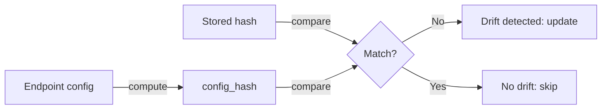

# Resource Config Drift Detection

Automatic detection and resolution of configuration drift between local `Endpoint` definitions and deployed Runpod endpoints.

## Overview

When you deploy an endpoint, Flash stores a hash of the configuration. On subsequent deployments, Flash compares the current hash against the stored one. If they differ, Flash automatically updates the remote endpoint.



## How It Works

### 1. Hash Computation

Each resource computes a hash excluding runtime-assigned fields:

```python
# fields excluded from hash (assigned by API, not user config)
RUNTIME_FIELDS = {
    "template", "templateId", "aiKey", "userId",
    "createdAt", "activeBuildid", "computeType",
    "hubRelease", "repo",
}

EXCLUDED_HASH_FIELDS = {"id"}
```

The `config_hash` property:
- Excludes all `RUNTIME_FIELDS` and `EXCLUDED_HASH_FIELDS`
- Serializes remaining fields as sorted JSON
- Computes an MD5 hash
- Returns hex digest

### 2. Drift Storage

When `ResourceManager` registers a resource, it stores the hash:

```python
# internal flow
self._resources[uid] = resource
self._resource_configs[uid] = resource.config_hash
```

### 3. Drift Detection

On subsequent deployments:

```python
# internal flow
existing = self._resources.get(resource_key)
stored_hash = self._resource_configs.get(resource_key)
new_hash = config.config_hash

if stored_hash != new_hash:
    # drift detected: update the endpoint
    updated = await existing.update(config)
```

## What Triggers Drift

Changes to these `Endpoint` parameters trigger drift detection and endpoint updates:

| Parameter | Internal Field | Triggers Drift |
|-----------|---------------|---------------|
| `gpu=` | `gpuIds` | Yes |
| `cpu=` | `instanceIds` | Yes |
| `workers=` | `workersMin`, `workersMax` | Yes |
| `scaler_type=` | `scalerType` | Yes |
| `scaler_value=` | `scalerValue` | Yes |
| `image=` | `imageName` | Yes |
| `datacenter=` | `datacenter`, `locations` | Yes |
| `gpu_count=` | `gpuCount` | Yes |
| `idle_timeout=` | `idleTimeout` | Yes |
| `execution_timeout_ms=` | `executionTimeoutMs` | Yes |
| `flashboot=` | `flashboot` | Yes |
| `volume=` | `networkVolume` | Yes |
| `template=` | `template` | Partially (template is a runtime field for some resource types) |
| `env=` | `env` | **No** (excluded from hash) |
| `name=` | `name` | **No** (identity only) |

### Why env is Excluded

Environment variables are excluded from the hash because:
- Different processes may load `.env` files with different values
- Changing env vars shouldn't trigger a full endpoint redeploy
- Env vars are updated separately via the API

## CPU LoadBalancer Special Case

CPU LoadBalancers hash only CPU-relevant fields:

```python
# CPU LB only hashes these fields:
cpu_fields = {
    "datacenter", "flashboot", "imageName", "networkVolume",
    "instanceIds", "workersMin", "workersMax", "scalerType",
    "scalerValue", "type", "idleTimeout", "executionTimeoutMs",
    "locations",
}
```

GPU-specific fields (`gpuIds`, `gpuCount`, `allowedCudaVersions`, `minCudaVersion`) are excluded from the CPU hash. This prevents false drift when GPU fields are set to defaults.

## User-Facing Example

```python
from runpod_flash import Endpoint, GpuGroup

# first deploy: hash stored
@Endpoint(name="inference", gpu=GpuGroup.AMPERE_80, workers=(0, 5))
async def infer(data: dict) -> dict:
    return {"result": data}

# flash deploy -> creates endpoint, stores hash abc123

# later: change workers
@Endpoint(name="inference", gpu=GpuGroup.AMPERE_80, workers=(1, 10))
async def infer(data: dict) -> dict:
    return {"result": data}

# flash deploy -> detects drift (abc123 != def456), updates endpoint

# later: change only env (no drift)
@Endpoint(
    name="inference",
    gpu=GpuGroup.AMPERE_80,
    workers=(1, 10),
    env={"NEW_VAR": "value"},
)
async def infer(data: dict) -> dict:
    return {"result": data}

# flash deploy -> no drift detected, endpoint not redeployed
```

## Testing

Drift behavior is tested in `tests/unit/resources/test_load_balancer_drift.py`:

```python
def test_same_config_same_hash():
    lb1 = LoadBalancerSlsResource(name="test", imageName="img:latest")
    lb2 = LoadBalancerSlsResource(name="test", imageName="img:latest")
    assert lb1.config_hash == lb2.config_hash

def test_image_change_triggers_drift():
    lb1 = LoadBalancerSlsResource(name="test", imageName="img:v1")
    lb2 = LoadBalancerSlsResource(name="test", imageName="img:v2")
    assert lb1.config_hash != lb2.config_hash

def test_template_excluded():
    lb = LoadBalancerSlsResource(name="test", imageName="img:latest")
    hash1 = lb.config_hash
    lb.template = PodTemplate(imageName="img:latest", name="test")
    assert lb.config_hash == hash1  # no drift
```

## Troubleshooting

### False Positives (drift detected when it shouldn't be)

- Check if a new runtime-assigned field was added but not listed in `RUNTIME_FIELDS`
- Check enum serializers handle both enum and string values

### Missing Drift Detection

- Check if the field is in `_hashed_fields` (for GPU resources) or `cpu_fields` (for CPU LB)
- CPU LoadBalancer ignores GPU fields by design

## Related Documentation

- [Deployment Architecture](Deployment_Architecture.md) -- how build and deploy work
- [GPU Provisioning](GPU_Provisioning.md) -- GPU-specific provisioning details
- [CPU Container Disk Sizing](CPU_Container_Disk_Sizing.md) -- CPU-specific disk defaults
